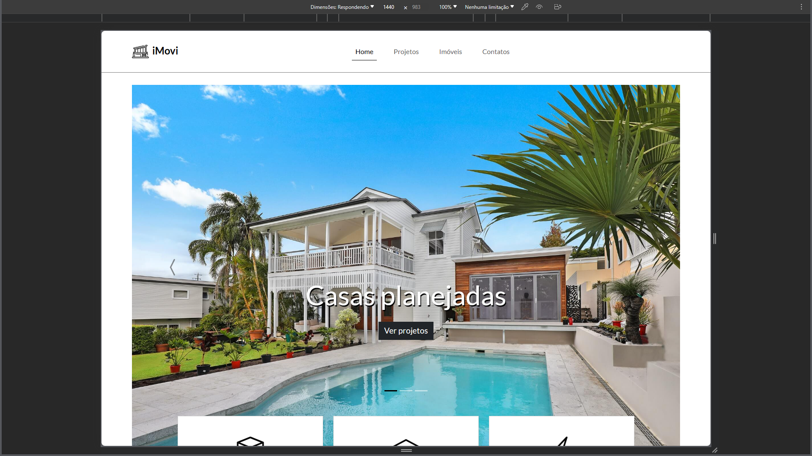
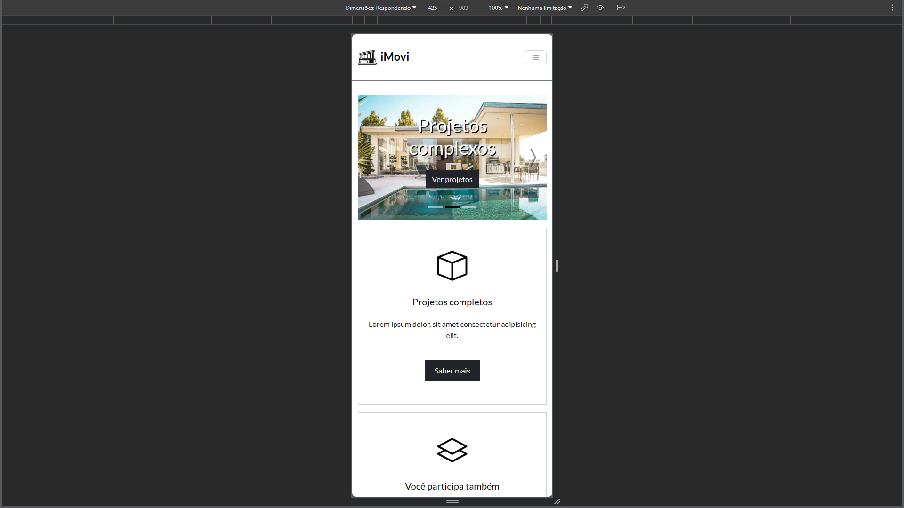

# Projeto site iMovi

Site desenvolvido com framework bootstrap.

## Screenshots

## Aprendizados

Foi minha primeira experiência com bootstrap, também ainda não havia visto a criação de um slide,acredito que o mobile-first facilitou bastante, as divisões de grid propostas pelo framework parecem ser muito úteis, assim como a utilização tanto do js e ícones são de grande valia. Seguirei para mais aprendizado.

## Referência

 - [Vídeo](https://www.youtube.com/watch?v=jJUpJA1GJHw) - Aprenda bootstrap 5
 - [Autor](https://github.com/matheusbattisti) - Matheus Battisti

---

